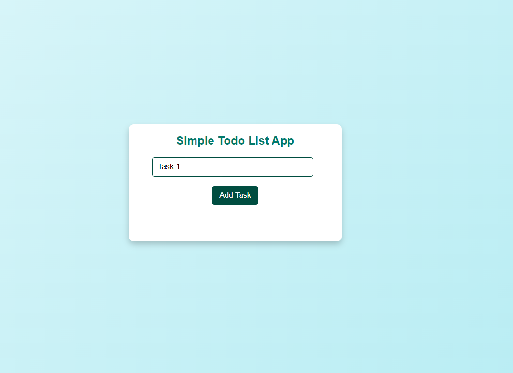
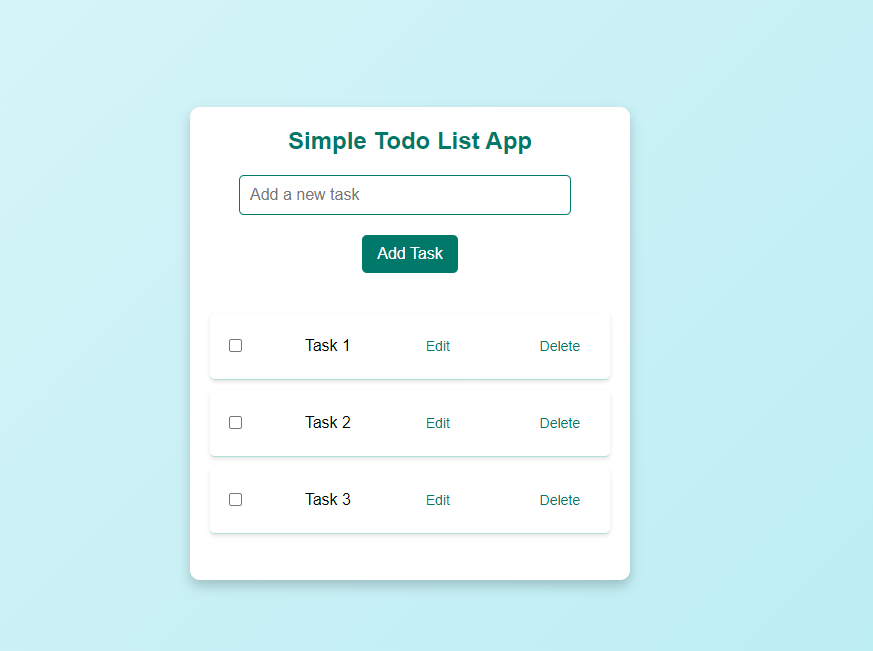
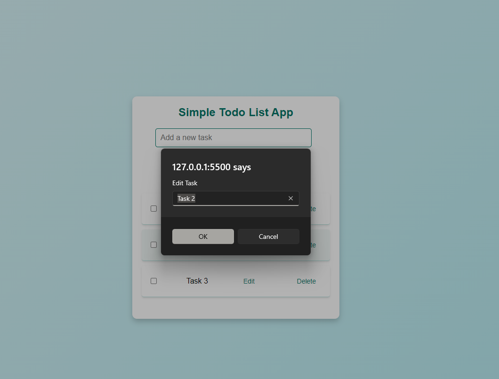
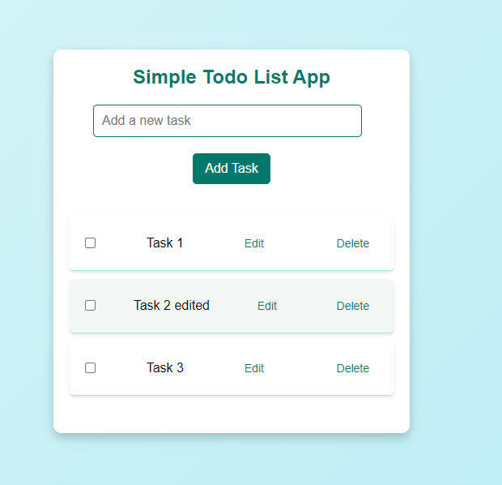
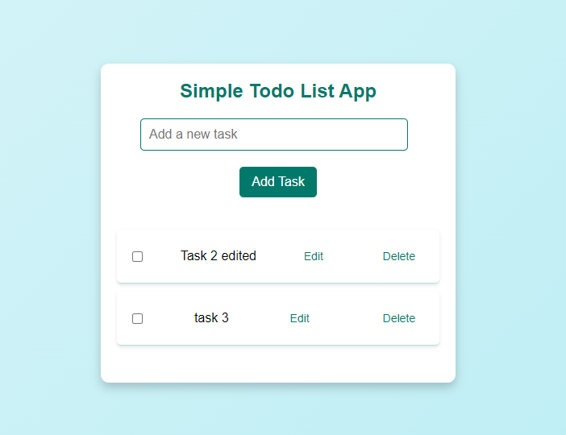
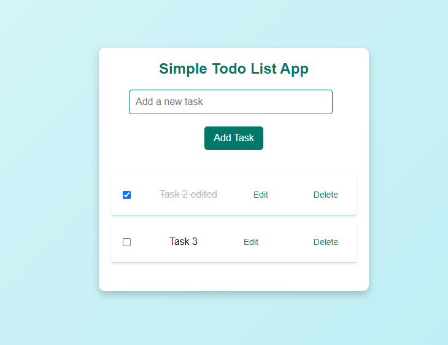

# Task Manager App

Overview
The Task Manager App is a simple web-based application designed to help users manage their to-do tasks. It provides functionalities to add, edit, delete, and mark tasks as complete. This app allows for easy task management with a minimalistic interface.

## Features

Add Task: Users can add a new task to the list by entering text and clicking the "Add" button.
Edit Task: Each task can be edited by clicking the "Edit" button next to it. Users can change the task text and save the updated value.
Delete Task: Users can remove tasks from the list by clicking the "Delete" button.
Toggle Completion: Users can mark tasks as complete or incomplete by checking/unchecking the checkbox next to each task.
Usage

### Add a Task

Enter your task in the input field.
Click the "Add" button to add the task to the list.

### Edit a Task

Click the "Edit" button next to the task you want to change.
Enter the new task text in the prompt that appears and click "OK".

### Delete a Task

Click the "Delete" button next to the task you want to remove.

### Toggle Completion

Click the checkbox next to the task to mark it as complete or incomplete. The task text will be visually updated to reflect its status.

# A2SV-Todo-List-App-Task2
